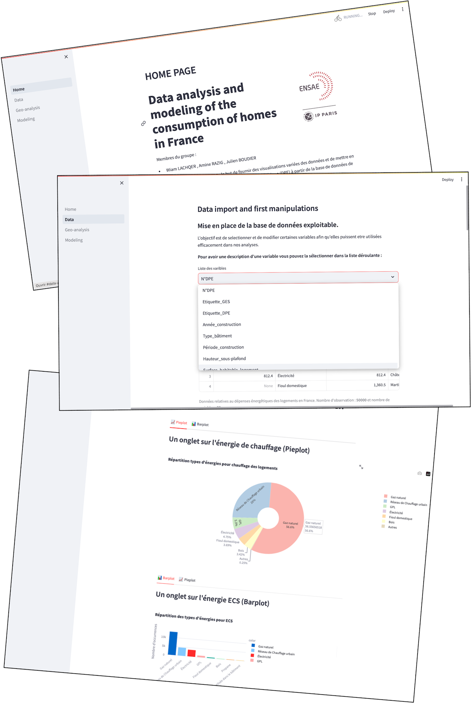
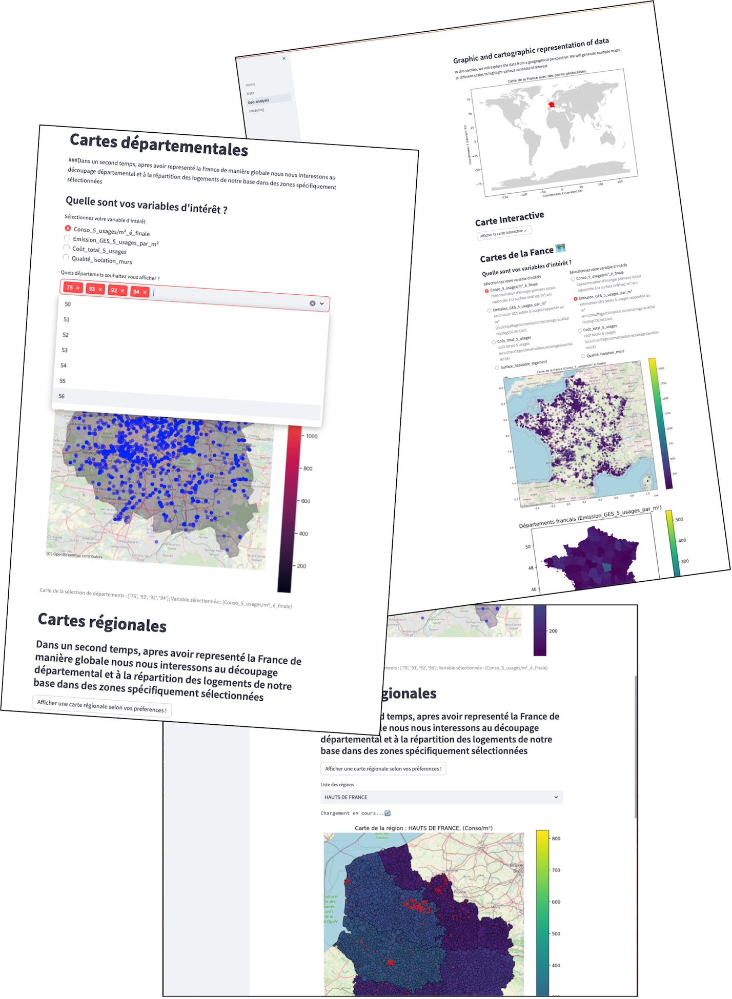
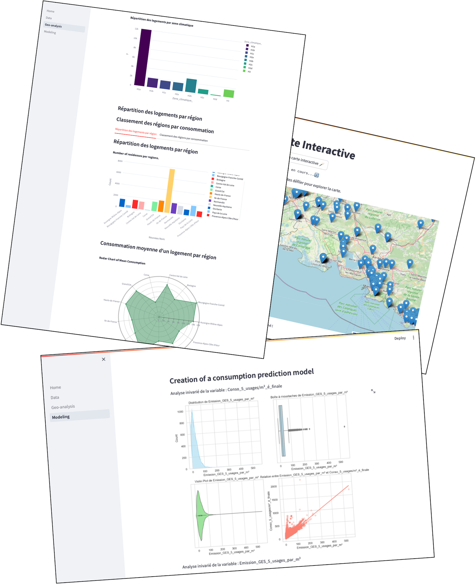
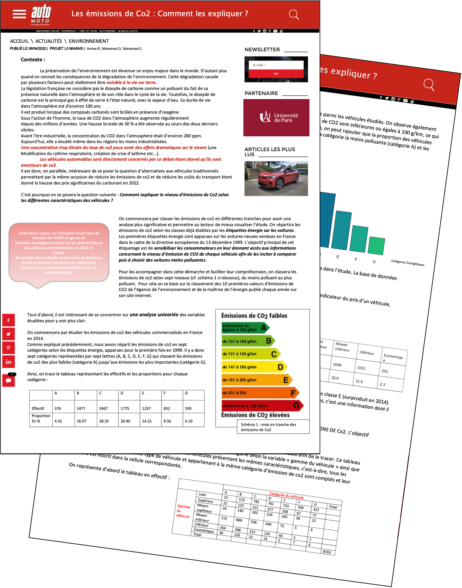

### Hi there 👋

- 😄 I’m currently working on academic and professional  Data Science projects
- 🌱 I’m currently learning Statistiques and ML at @EcolePolytechnqiue and @ENSAE PARIS

Here is an overline of some of the reports made on the occasion of different projects made available on my GitHub :✨

## DPE simulator of French housing:
  

## Prediction of Co2 emissions from vehicles marketed in France in 2014:

