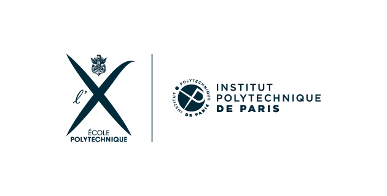

### Hi there 👋 Welcome to my GitHub profile !
  

#### About me

- 😄 I’m currently working on academic and professional  Data Science projects
- 🌱 I’m currently learning Statistiques and ML at @[EcolePolytechnique](https://synapses.polytechnique.fr/catalogue/2023-2024/diplome/26/M2DS-m2-data-sciences) and @[ENSAE PARIS](https://www.ensae.fr/formation/cycle-ingenieur/troisieme-annee/data-science-statistique-et-apprentissage). (For course details, follow the links)

#### Some projects
Here is an overline of some of the reports made on the occasion of different projects made available on my GitHub :✨

----------------------
## DPE simulator of French housing:
  

## Prediction of Co2 emissions from vehicles marketed in France in 2014:

## And some more or less complex python tools for various tasks ...

