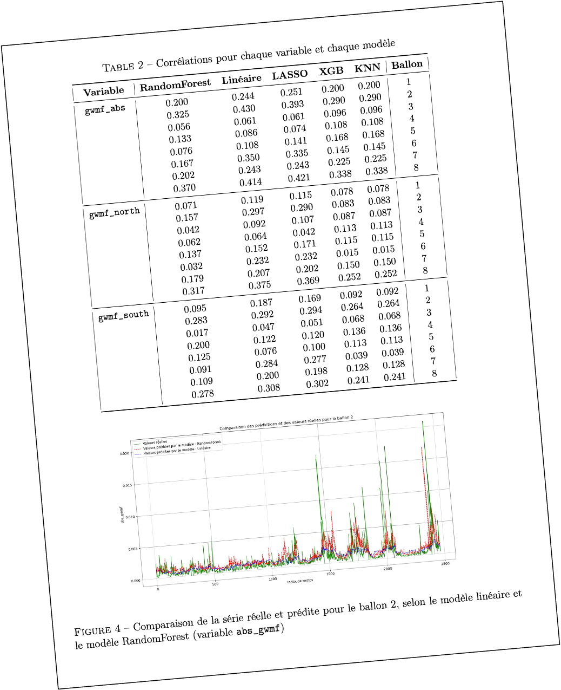

### Hi there 👋 Welcome to my GitHub profile !
  

#### About me

- 😄 I’m currently working on academic and professional  Data Science projects
- 🌱 I’m currently learning Statistiques and ML at @[EcolePolytechnique](https://synapses.polytechnique.fr/catalogue/2023-2024/diplome/26/M2DS-m2-data-sciences) and @[ENSAE PARIS](https://www.ensae.fr/formation/cycle-ingenieur/troisieme-annee/data-science-statistique-et-apprentissage). (For course details, follow the links)

#### Some projects
Here is an overline of some of the reports made on the occasion of different projects made available on my GitHub :✨

----------------------
## ML based "dpe" simulator of French housing:
> **Technologies**: Python, Machine Learning libraries (scikit-learn, etc.), Pandas, GeoPandas, Streamlit. Project repository [here](https://github.com/arazig/Statistical-learning-for-climate-models)

  

## Statistical learning for climate models: 
> **Technologies**: Python, Machine Learning libraries, Time-Series Analysis (statsmodels, etc.). Project repository [here](https://github.com/arazig/Statistical-learning-for-climate-models)

  

## Language evolution Physics applied to HSS:
> Group project - Development of language evolution model from the article "Sharp transition towards shared vocabularies in multi-agent systems" .[Here](https://github.com/arazig/Language-evolution_Physics-applied-to-HSS)

## Network-optimization-transport-graph
> Python programming project object oriented on the optimization of a delivery network, Algo ... [Here](https://github.com/arazig/Network-optimization-transport-graph)

## Prediction of Co2 emissions from vehicles marketed in France in 2014:
> **Technologies**: R, Statistical Libraries (tidyverse, ggplot2). Project repository [here](https://github.com/arazig/Projet_R-emissions_CO2_vehicules)

## And some python tools for various tasks ...

